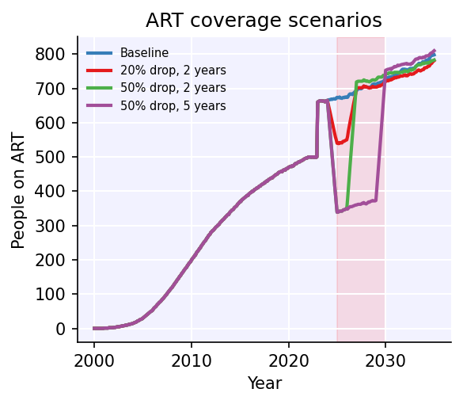
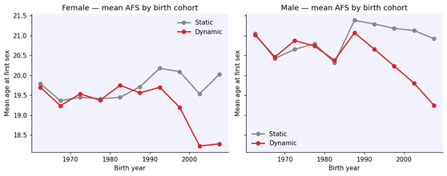

# Examples Gallery

Worked examples illustrating STIsim features. Each example is a runnable
Jupyter notebook — download and adapt to your own use case.

-   :material-pill:{ .lg .middle } **Modeling ART interruptions**

    ---

    { width="280" }

    Simulate exogenous shocks to ART coverage using mixed-format DataFrames.
    Build scenario-specific coverage, run counterfactuals, and compare outcomes.

    [:octicons-arrow-right-24: Open example](art_interruptions.ipynb)

    :material-tag-outline: *New in v1.5.3* · :material-clock-outline: *~30s*

-   :material-chart-line:{ .lg .middle } **Time-varying age at sexual debut**

    ---

    { width="280" }

    Use callable distribution parameters to model AFS declining over time.
    Compare static vs dynamic debut and see the effect on birth-cohort means.

    [:octicons-arrow-right-24: Open example](dynamic_debut.ipynb)

    :material-tag-outline: *New in v1.5.4* · :material-clock-outline: *~30s*

