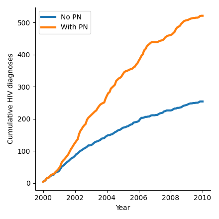
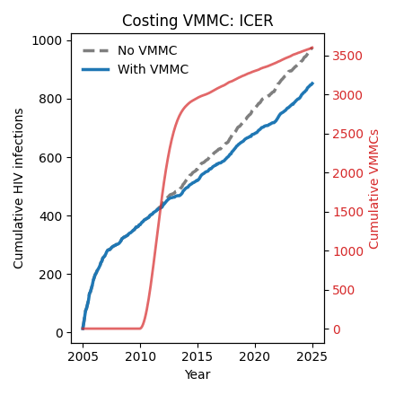
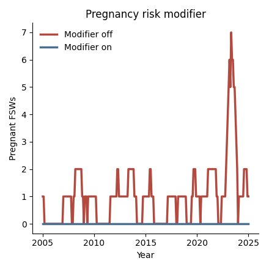

# Examples gallery

Worked examples illustrating STIsim features. Click any tile to open the runnable notebook.

  <a href="art_interruptions.qmd"><figure><figcaption>What happens if ART supply is temporarily cut off?</figcaption></figure></a>
  <a href="dynamic_debut.qmd"><figure><figcaption>What happens when age at first sex declines over time?</figcaption></figure></a>
  <a href="partner_notification.qmd"><figure><figcaption>How does partner notification reach contacts of newly diagnosed agents?</figcaption></figure></a>
  <a href="vmmc_costing.qmd"><figure><figcaption>How do you compute an ICER for an intervention like VMMC?</figcaption></figure></a>
  <a href="pregnancy_risk_modifier.qmd"><figure><figcaption>How do agents change sexual-risk behaviour during pregnancy?</figcaption></figure></a>

