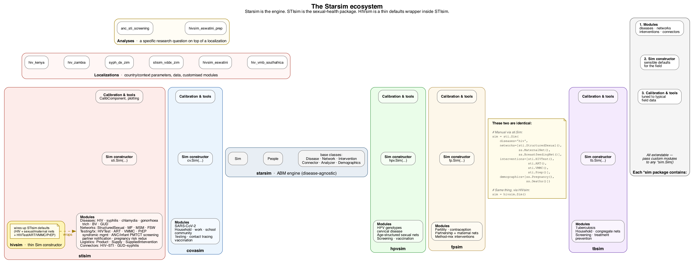

# User guide

STIsim is built on top of [Starsim](https://docs.starsim.org). For understanding the core model architecture -- agents, modules, parameters, time handling, results, and the simulation loop -- the [Starsim user guide](https://docs.starsim.org/user_guide/intro_starsim.html) is your primary reference.

## Architecture

Starsim is a disease-agnostic agent-based modeling engine: it defines `Sim`, `People`, and the base classes (`Disease`, `Network`, `Intervention`, `Connector`, `Analyzer`, `Demographics`) that every `*sim` package builds on. STIsim is one of several disease packages built on Starsim, alongside Covasim, HPVsim, FPsim, and TBsim -- each supplies disease modules, networks, and interventions relevant to its field, a `Sim` subclass with sensible field defaults, and calibration tooling tuned to typical data for that disease area.

**HIVsim is not a separate package with its own modules -- it's a thin `Sim` subclass living inside STIsim** that wires up HIV-appropriate defaults (the `HIV` disease, sexual/maternal/breastfeeding networks, and `HIVTest`/`ART`/`VMMC`/`Prep`). Constructing a sim manually via `sti.Sim(diseases='hiv', ...)` with those same modules and constructing it via `hivsim.Sim()` produce identical sims -- HIVsim exists purely to save typing the common case, not to add capability `sti.Sim` doesn't have. See the [HIVsim page](hivsim.md) for the full defaults and when to reach for it instead of `sti.Sim`.

Two further layers sit on top of STIsim, outside this repository: **localizations** (e.g. `hiv_kenya`, `hiv_zambia`) supply country/context-specific parameters, data, and any customized modules needed to instantiate a real epidemic model, and **analyses** (e.g. `anc_sti_screening`) layer a specific research question on top of a localization. Push code to the highest layer where it's genuinely reusable without modification -- a testing/treatment pattern that works for any HIV model belongs here in STIsim; one hardcoded to a specific country's data belongs in that country's localization repo.

This user guide documents what STIsim adds on top of Starsim:

- **[Diseases](diseases/index.md)** -- State diagrams and parameter tables for each STI module (HIV, syphilis, chlamydia, gonorrhea, trichomoniasis, BV, GUD).
- **[Networks](networks/structured_sexual.md)** -- The structured sexual network: risk groups, partnership types, age mixing, sex work, and condom use. See also [pair matching](networks/matching.md) and [MSM networks](networks/msm.md).
- **[Interventions](interventions/interventions.md)** -- Testing, treatment, HIV-specific interventions (ART, VMMC, PrEP), syndromic management, ANC/infant (PMTCT) screening, partner notification, and pregnancy-driven risk reduction.
- **[Analyzers](analyzers.md)** -- Observe and record derived results: coinfection, sex-work transmission, and network/partnership structure.
- **[Care-seeking](care_seeking.md)** -- Cross-disease care-seeking propensity shared across interventions.
- **[Connectors](connectors.md)** -- Coinfection interactions between co-circulating diseases.
- **[Calibration](calibration.md)** -- Fitting model parameters to data with Optuna.
- **[HIVsim](hivsim.md)** -- The HIV-focused convenience wrapper around `sti.Sim`.
